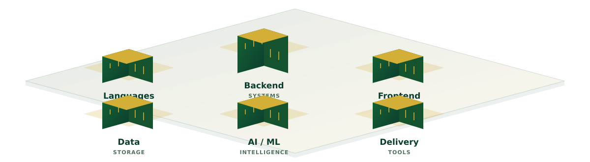
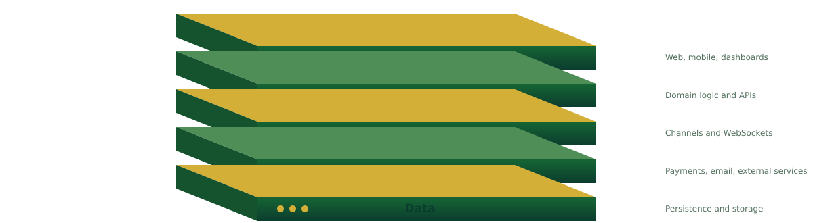
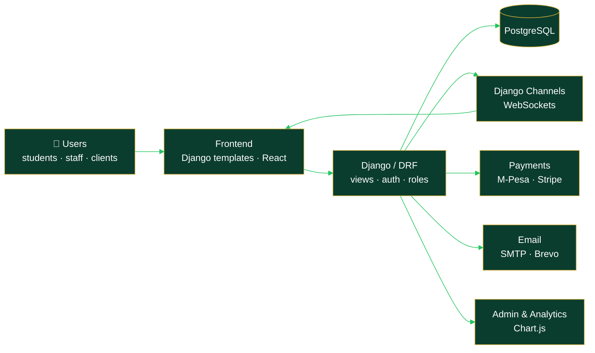

<a id="top"></a>

<div align="center">


<a href="#contact">

</a>

<br/>

**`⟦ JUMP TO ⟧`**

<a href="#whoami"></a>
<a href="#stack"></a>
<a href="#projects"></a>
<a href="#services"></a>
<a href="#contact"></a>

<br/><br/>


</div>

---

<a id="whoami"></a>

## `⟦ 01 ⟧` whoami

```bash
shevi@santos360:~$ whoami --verbose

  name ............. Shevi Santos  (Mbogo Zabron)
  role ............. ICT Officer · Python / Django Developer
  company .......... Founder — Santos 360 Tech Solutions
  services ......... software development · IoT solutions
  affiliation ...... Mbeya University of Science and Technology (MUST)
  base ............. Mwanza, Tanzania 🇹🇿  [UTC+3 · EAT]
  builds ........... institutional systems · client platforms · ML apps
  status ........... ONLINE — open to client projects & collaboration

shevi@santos360:~$ _
```

<div align="center">

| 🏛️ Institutional | 💼 Commercial | 🌱 Research |
|:---:|:---:|:---:|
| Systems used by MUST students & staff | Client platforms via Santos 360 | Deep learning for crop disease |

</div>

---

## `⟦ 02 ⟧` choose your path

> **This README is interactive** — open the panel that fits you.

<details>
<summary><b>🎯 I'm a RECRUITER / HIRING MANAGER</b> <code>click to expand</code></summary>

<br/>

| | |
|---|---|
| **Title** | Python / Django Developer · ICT Officer |
| **Company** | Founder, Santos 360 Tech Solutions (software + IoT) |
| **Backend** | Python · Django · Django REST Framework · Django Channels · Java Spring Boot |
| **Frontend** | Django templates · Bootstrap 5 · React + TypeScript · Chart.js |
| **Data** | PostgreSQL · SQLite |
| **ML** | TensorFlow / Keras · transfer learning · ensemble models · Gradio |
| **Shipped** | MUST e-Mrejesho · MUST Housing System · Tomato_ResB0 classifier |
| **Location** | Mbeya, Tanzania — UTC+3 |

**Fastest path:** [e-Mrejesho live](https://mustso-e-mrejesho.vercel.app) → [projects](#projects) → [contact](#contact)

</details>

<details>
<summary><b>⚙️ I'm an ENGINEER — show me how you build</b> <code>click to expand</code></summary>

<br/>

**1. Build for the real users, in their language.**
My systems use Swahili where it matters, TZS currency, M-Pesa payments and local workflows — software that fits Tanzanian institutions instead of forcing them to fit it.

**2. Realtime by default when people are waiting.**
Feedback platforms and dashboards push updates over WebSockets (Django Channels) so users see status changes the moment they happen.

**3. Traceability is a feature.**
UUID primary keys, human-readable tracking numbers and role-based access (student / representative / admin) make every request auditable end to end.

**4. Measure, don't guess — especially in ML.**
For tomato disease detection I benchmarked EfficientNet-B0, ResNet-50, a custom residual CNN and a CNN–SVM hybrid before choosing a soft-voting ensemble.

</details>

<details>
<summary><b>💼 I want to HIRE Santos 360 Tech Solutions</b> <code>click to expand</code></summary>

<br/>

```bash
shevijeremiah@gmail.com:~$ ./engage --client you

  [1] discovery call ...... what you need, who uses it, what "done" means
  [2] proposal ............ scope, timeline, milestones, price
  [3] build ............... phased delivery, demo at every milestone
  [4] handover ............ source code, docs, deployment, support
```

See the full list of services in [`⟦ 05 ⟧ services`](#services).

</details>

<details>
<summary><b>🎓 I'm a STUDENT at MUST (or anywhere)</b> <code>click to expand</code></summary>

<br/>

- **Solve a problem on your own campus.** e-Mrejesho and the Housing System started as "this process is painful — let's fix it."
- **Finish the boring parts.** Roles, permissions, payments and emails are where real systems live.
- **Deploy it.** A live link beats a perfect repo nobody can open.
- **Write it up.** A good report or paper turns a project into proof of skill.

</details>

---

<a id="stack"></a>

## `⟦ 03 ⟧` tech stack

<div align="center">

</div>

> **33 tools across 6 domains.** Expand any group below for the full list.

<details open>
<summary><b>◆ Languages</b></summary>
<br/>


</details>

<details open>
<summary><b>◆ Backend & Realtime</b></summary>
<br/>


</details>

<details open>
<summary><b>◆ Frontend</b></summary>
<br/>


</details>

<details open>
<summary><b>◆ Data, Payments & Integrations</b></summary>
<br/>


</details>

<details open>
<summary><b>◆ Machine Learning</b></summary>
<br/>


</details>

<details open>
<summary><b>◆ IoT, Networking & DevOps</b></summary>
<br/>


</details>

<p align="right"><a href="#top">↑ back to top</a></p>

---

<a id="projects"></a>

## `⟦ 04 ⟧` projects

### `[ LIVE ]` 🗳️ MUST e-Mrejesho

**`STUDENT GOVERNMENT FEEDBACK & ACCOUNTABILITY PLATFORM`**

<a href="https://mustso-e-mrejesho.vercel.app"></a>


A platform where MUST students send feedback to their student government and track exactly what happens to it.

<details>
<summary><b>▶ what's inside</b></summary>
<br/>

- Four Swahili-named feedback types, each with its own tracking number
- Three roles — **Student**, **Representative**, **Admin**
- Realtime status updates with **Django Channels**
- **Promise Tracker** and a **Public Document Repository** for accountability
- Custom admin panel with **Chart.js** analytics, plus a Jazzmin-themed Django admin
- Email notifications over Gmail SMTP · UUID primary keys · MUST green & gold branding

</details>

---

### 🏠 MUST Housing System

**`STUDENT ACCOMMODATION MANAGEMENT`**


Connects students, landlords and administrators in one booking platform.

<details>
<summary><b>▶ what's inside</b></summary>
<br/>

- Roles for **students**, **landlords** and **admins**
- Booking and approval workflows from request to confirmation
- **M-Pesa** and manual payment support, priced in **TZS**
- MUST-branded Bootstrap 5 interface with full template coverage

</details>

---

### 🍅 Tomato_ResB0 — Tomato Leaf Disease Detection

**`DEEP LEARNING FOR TANZANIAN FARMERS · MUST FINAL YEAR PROJECT`**


A soft-voting ensemble of **ResNet-50** and **EfficientNet-B0** that identifies tomato leaf diseases and suggests treatment.

<details>
<summary><b>▶ how it was built</b></summary>
<br/>

| Model compared | Role |
|---|---|
| EfficientNet-B0 | Ensemble member |
| ResNet-50 | Ensemble member |
| Custom residual CNN | Baseline |
| Hybrid CNN–SVM | Baseline |

- Gradio app with a dark botanical interface
- Tanzania-localized treatment database — Swahili notes, TSh pricing, local agro-dealer references
- Full project report and a companion research paper

</details>

---

### 🧭 TripPilot AI `[ IN PROGRESS ]`

**`AI-POWERED TRIP PLANNING`**

Multi-city trip planning with per-destination room setups, guest planning before sign-up, email login and password recovery.

---

### 🏢 Smart Office Automation System

**`IOT · GROUP 08 · CISCO PACKET TRACER`**

An automated office network simulated in Cisco Packet Tracer — smart devices, sensors and controls working together.

---

### 🗂️ More work

| Project | Type | Stack |
|---|---|---|
| **Uzanite** | Client rebuild | React + TypeScript · Spring Boot · PostgreSQL |
| **Volunteer to Tanzania** | Client website | Web · Netlify |
| **VOT Mwanza EDU** | E-learning / LMS setup | LMS · DNS · hosting |

<p align="right"><a href="#top">↑ back to top</a></p>

---

<a id="services"></a>

## `⟦ 05 ⟧` Santos 360 Tech Solutions — services

<div align="center">


</div>

| Service | What you get | Stack |
|---|---|---|
| 🏛️ **Institutional Management Systems** | Role-based portals for universities, schools and organisations | Django · PostgreSQL |
| 🌐 **Business Websites & Web Apps** | Fast, professional sites and custom platforms | Django · React · Bootstrap |
| 💳 **Payments Integration** | Mobile money and card payments wired into your system | M-Pesa · Stripe |
| ⚡ **Realtime Dashboards** | Live updates and analytics your team can act on | Django Channels · Chart.js |
| 🔌 **IoT Solutions** | Connected devices, automation and network design | IoT · Cisco |
| 🤖 **Applied Machine Learning** | Image classification and prediction tools with a usable interface | TensorFlow · Gradio |

<p align="right"><a href="#top">↑ back to top</a></p>

---

## `⟦ 06 ⟧` how my Django systems fit together

<div align="center">

</div>

<details>
<summary><b>▶ trace a request through the layers</b> <code>click to expand</code></summary>
<br/>



</details>

<p align="right"><a href="#top">↑ back to top</a></p>

---

## `⟦ 07 ⟧` github stats

<div align="center">

GitHub's profile pages provide live repository and contribution data directly, without third-party stats cards.

| [Repositories](https://github.com/SHEVISANTOS?tab=repositories) | [Contribution activity](https://github.com/SHEVISANTOS?tab=overview) | [Starred projects](https://github.com/SHEVISANTOS?tab=stars) |
|:---:|:---:|:---:|
| Browse projects and languages | View the contribution graph | Explore saved projects |

</div>

---

<a id="contact"></a>

## `⟦ 08 ⟧` contact

<div align="center">

**`// PICK A CHANNEL`**

<a href="mailto:YOUR_shevijeremiah@gmail.com"></a>
<a href="https://www.linkedin.com/in/"></a>
<a href="https://wa.me/255625000799"></a>
<a href="https://github.com/SHEVISANTOS/SHEVISANTOS/issues/new?title=%5BPROJECT%5D%20Proposal&body=**What%20you%20need%3A**%0A%0A**Timeline%3A**%0A%0A**Budget%20range%3A**%0A"></a>

</div>

<details>
<summary><b>❓ FAQ</b> <code>click to expand</code></summary>
<br/>

**What do you build?**
Web systems for institutions and businesses — mostly Django backends with role-based access, payments, realtime updates and admin dashboards — plus IoT and applied ML projects.

**Do you take client work?**
Yes, through Santos 360 Tech Solutions. Use the 📨 button above or email me.

**What timezone are you in?**
East Africa Time (UTC+3).

**Can I use your public code?**
Yes — read it, fork it, learn from it. A star or a message is always appreciated.

</details>

<details>
<summary><b>🔒 DO NOT OPEN</b></summary>
<br/>

```bash
shevi@santos360:~$ sudo cat /secret
[ WARN ] you were told not to open this...

  > achievement unlocked: read_the_whole_readme
  > most people stop at the badges. you didn't.
  > let's build something — hit the email button above.
```

</details>

<br/>

<div align="center">

**Built in Mwanza, Tanzania 🇹🇿 · Santos 360 Tech Solutions**

<a href="#top">↑ back to top</a>


</div>
